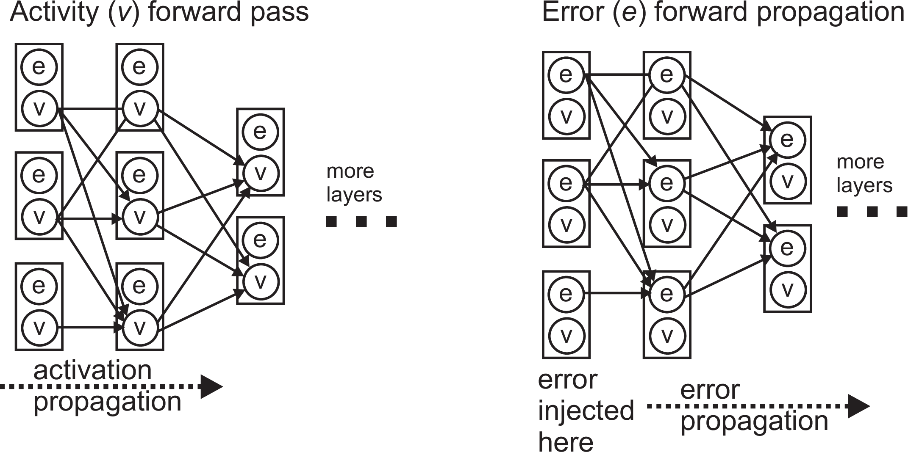
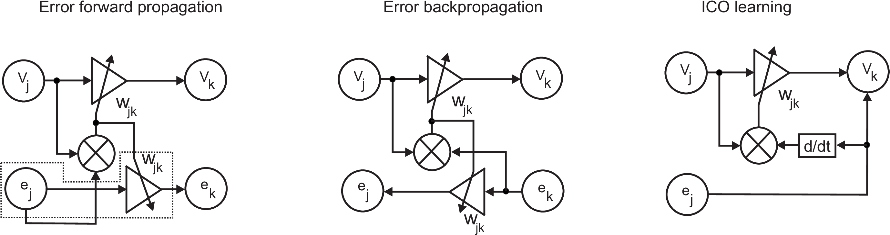

# Feedforward Closedloop Learning (FCL)

[Forward propagation closed loop learning
Bernd Porr, Paul Miller. Adaptive Behaviour 2019.](https://journals.sagepub.com/doi/10.1177/1059712319851070)

[Submission version](https://www.berndporr.me.uk/Porr_Miller_FCL_2019_Adaptive_Behaviour.pdf)

## Error _forward_ propagation



For an autonomous agent, the inputs are the sensory data that inform the agent of the state of the world, and the outputs are their actions, which act on the world and consequently produce new sensory inputs. The agent only knows of its own actions via their effect on future inputs; therefore desired states, and error signals, are most naturally defined in terms of the inputs. Most machine learning algorithms, however, operate in terms of desired outputs. For example, backpropagation takes target output values and propagates the corresponding error backwards through the network in order to change the weights. In closed loop settings, it is far more obvious how to define desired sensory inputs than desired actions, however. To train a deep network using errors defined in the input space would call for an algorithm that can propagate those errors _forwards_ through the network, from input layer to output layer, in much the same way that activations are propagated.

Comparison between FCL, backprop and ICO learning:



## Prerequisites (Linux)

Ubuntu LTS with swig installed.

## How to compile / install?

### From source under Linux (C++ and Python)
```
      cmake .
      make
      sudo make install
      ./setup.py install --user
```

### Windows

```
cmake -G "Visual Studio 16 2019" -A x64 .
```
then start Visual Studio. See `cmake -G` for more target options.

### From PyPi (Python only)

https://pypi.org/project/feedforward_closedloop_learning/

## Demos

   * A classic line follower demo in `linefollower/` and
   * our vizdoom demo where our FCL agent fights against another automated agent: https://github.com/glasgowneuro/fcl_doom

## Class reference

The online documentation can be found here: https://glasgowneuro.github.io/feedforward_closedloop_learning/

The documentation is in the `docs` subdirectory in HTML, RTF and PDF.

## License

GNU GENERAL PUBLIC LICENSE

Version 3, 29 June 2007

```
(C) 2017-2022, Bernd Porr <bernd@glasgowneuro.tech>
(C) 2017,2018, Paul Miller <paul@glasgowneuro.tech>
```
## Citation

[](https://doi.org/10.5281/zenodo.2644304)
